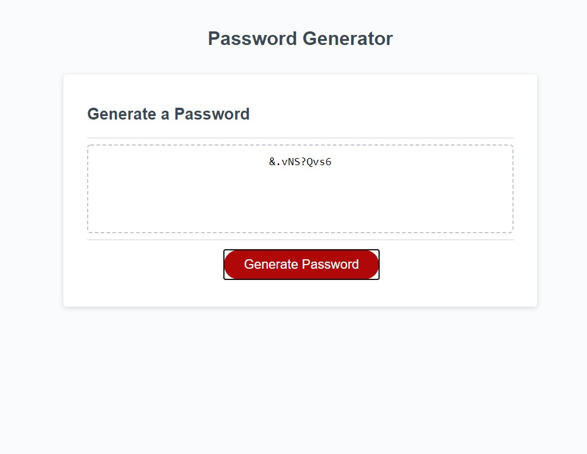

# Password Generator
(the strength of resulting passwords is kind of debatable, but this is all a learning journey)

## What it does
When the user clicks "generate," a series of pop-ups ask for the needed password requirements (number of characters, what characters to include). Once the requirements are given, a randomly generated password displays in the box.

## How it works
- Clicking the "generate" button calls a function that starts the series of pop-ups
- First is a prompt asking for the desired length of password, setting the length of the random string that will be generated
- Then a series of confirm boxes ask for which characters should be included - lower case letters, upper case letters, numbers, and special characters
- Depending on the user's response, strings containing the various characters are concatenated to form the string of possible characters to include in the password
- A function using math.random generates a random selection of characters to the desired length
- The resulting password displays in the box

## Checks and balances
- Passwords must be 8-128 characters in length--if a number outside that range is entered, an alert pops up and the user is brought back to the start
- If no character options are selected, an alert pops up stating that some sort of characters are required
- After a password generates, the source string resets so that a fresh password can be generated without reloading the page

https://artemissorrow.github.io/strong-password-generator/

